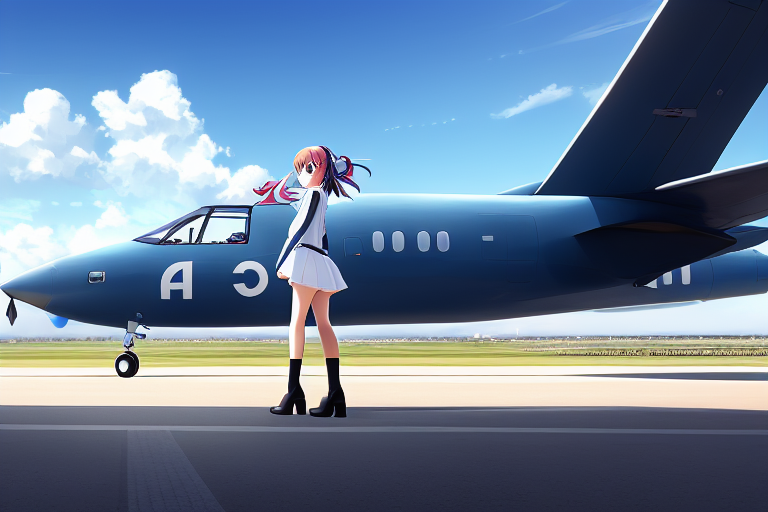
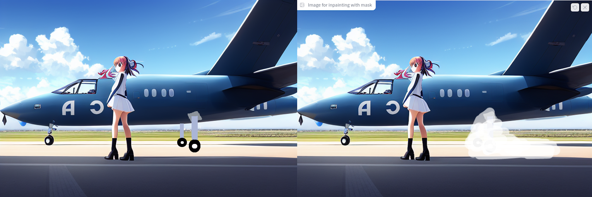
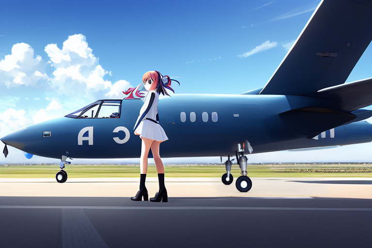
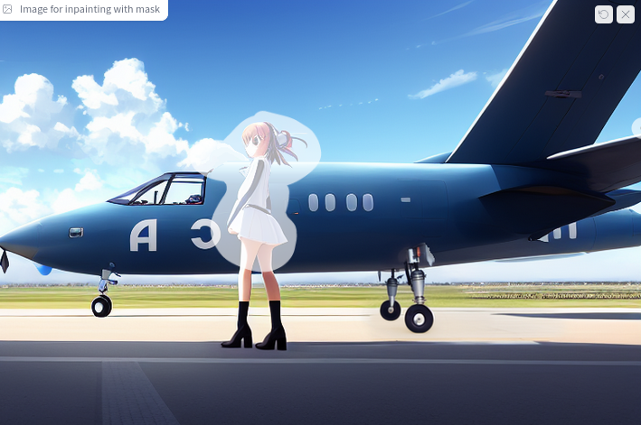
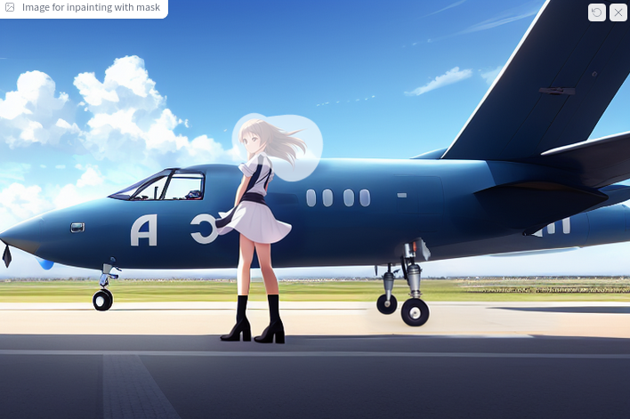
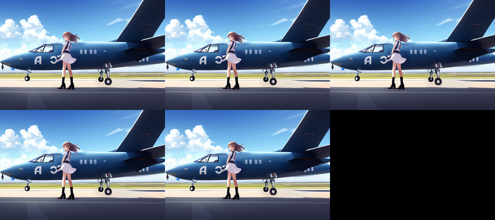
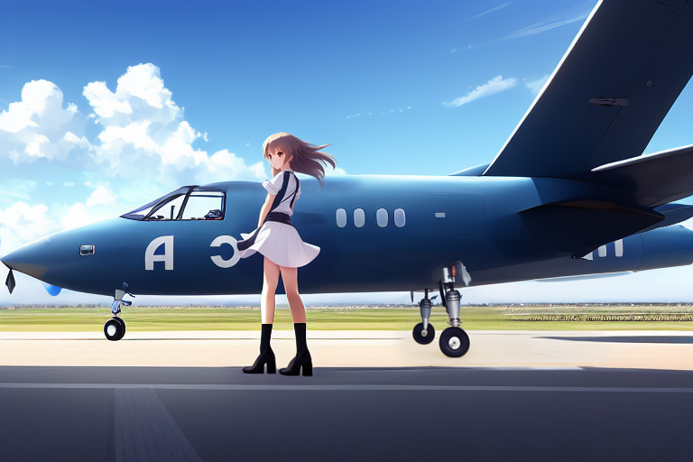
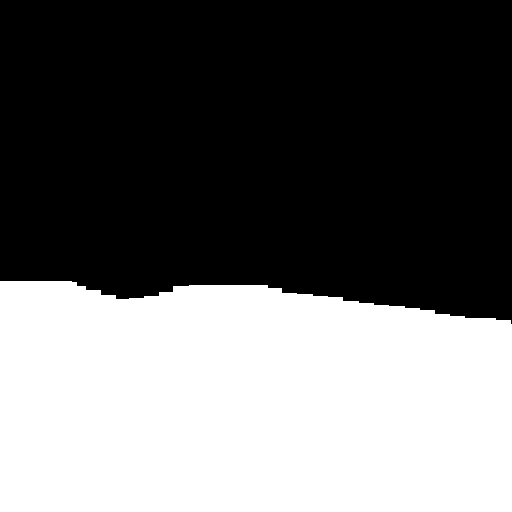
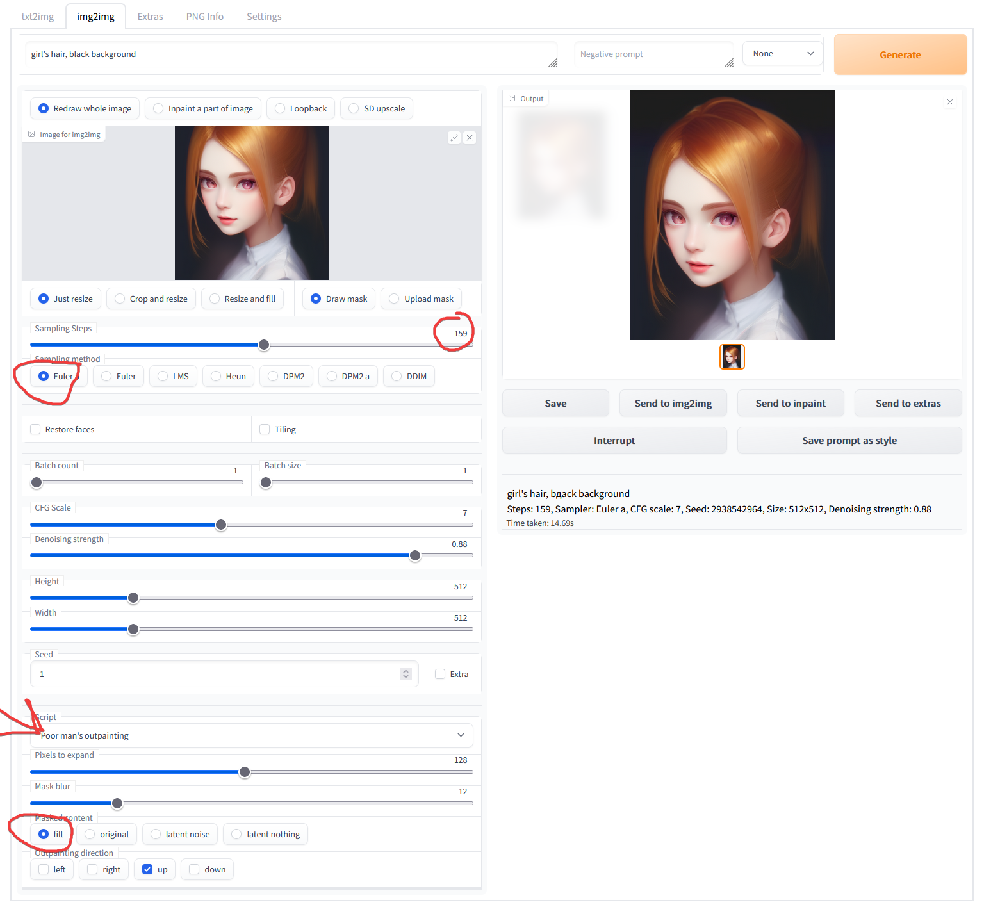

# Inpainting & Outpainting

[rentry.org](https://rentry.org/drfar)

[TOC]

Are your generated images disappointing? Is the AI letting you down? Well fear not! There is a tool you can use to work with the AI to get the image you want.

**What's inpainting?**
Inpainting is a way to "fill in" parts of an image. In the context of stable diffusion that means making the AI regenerate part of the image.

**How do I get to the inpainting section of the WebUI?**
At the top of the WebUI click the `img2img` tab.

**That's cool, but what do I use it for?**
It has two primary uses:
1. Fixing wonky parts of the image.
2. Working with the AI to modify an existing image.

## Let's do it!

**Prompt**
We're going to need a special prompt for inpainting, one that focuses on the elements of the image that you want to change. I have a few prompts I copy&paste for certain parts of the image.

|||
|-|-|
|**Faces**|<describe the face here> medium shot, extremely detailed, intricate, ((clear focus)), ((sharp focus)), perfect face, very deep eyes|
|**Anime Faces**|<describe the face here> medium shot, anime, extremely detailed, intricate, ((clear_focus)), ((sharp_focus)), perfect_face, very deep eyes, ((round pupils)), big anime eyes|
|**Hands**|perfect hands, realistic hands, extremely detailed hands, individual fingers, intricate fingers, 8k hands|

You can put whatever works best in the negative prompt.

**Change these settings**

Below the prompt box, click the second radio button: `Inpaint a part of image`

`Sampling Steps`: set it to whatever is getting you good results.

`Masked content`: set to `original`. This setting controls what the AI does with the masked content. Basically, `fill` makes the AI erase and regenerate it and `original` tells it to base its generation off the original content.

`Inpaint at full resolution`: check this box. This setting will make the AI upscale the masked region to your target resolution, do the inpainting, then resize it and place it back in the image. This enables very intricate generation of small regions of the image.

`Batch count`: it will probably take a few attempts for the AI to create what you want it to so why not speed the process up by generating multiple images in one go?

`CFG Scale`: how closely the AI adheres to your prompt. Set to whatever has been working best for you.

`Denoising strength`: determines how little respect the algorithm should have for image's content. At 0, nothing will change, and at 1 you'll get an unrelated image. Start at 0.3 and work your way up from there.

`Height` & `Width`: set to the dimensions of your image.

   

I'll walk you through the process of how to do this. I'm going to use this image generated using the waifu-diffusion model.

It's a complex scene with a few issues. Let's start by adding landing gear. I'm going to open the image in my external photo editor (I use GIMP) and sketch out the landing gear and then upload it to the WebUI and mask it.

On the left is the landing gear I have drawn. On the right is the masked image, with the white being the mask I have drawn on using the WebUI's masking tool.

As you can see, my drawing is really poor. But it doesn't have to be a quality drawing, it just has to give the AI an idea of what you want. Make sure the perspective and rough colors are correct. I also was very generous with the masking to allow it to generate shadows. My prompt will be "landing gear, shadows" and I'm going to turn up the denoising strength to give the AI some freedom to do what it wants. Next I generated a batch of five images. The results weren't very good because the AI was just mimicking what I had drawn. I increased the denoising strength to 0.65 and ran it again.

Hey, that's pretty good! It didn't add any shadows but I can try to fix that by masking where they should be and running it with the prompt "shadows".

Next, let's remove that flag thing in front of the girl. Back to GIMP to color it out. I'll use the AI to blend the details and remove any leftover traces of my erasure.

I'm not satisfied with her skirt, it looks a little chuncky. Let's try to knock out both the skirt and the face at the same time. Normally you'd want to focus on one thing at a time but I want to capture the movement between the hair and clothes.

My prompt will be `cute girl looking straight ahead, hair blowing in wind, skirt blowing in wind, medium shot, anime, extremely detailed, intricate, ((clear focus)), ((sharp focus)), perfect face, very deep eyes`

My negative prompt will be `deformed, blurry, bad anatomy, disfigured, poorly drawn face, mutation, mutated, extra_limb, ugly, poorly drawn hands`. I'm going to generate five samples at denoise 0.4 (giving some room to the AI for it to play with the hair). After the first set of five I decided 0.4 didn't create enough blowing hair so I bumped it up to 0.65.

**Input:**

**Output:**

There certainly is a lot of shared energy between the skirt and hair. This one is my favorite.

The skirt was originally a little transparent by the backwards `C` so I ran it through again with `transparent` in the negatives. The AI understood what I meant and fixed it for me.

Now, lets fix her face.  Be careful to only mask the face and hair to preserve what has been fixed already. I'm going to run this at `0.3` denoise since we've already done a lot of work in this area.

Same prompt, minus the skirt part:`cute girl looking up at sky, hair blowing in wind, medium shot, anime, extremely detailed, intricate, ((clear focus)), ((sharp focus)), perfect face, very deep eyes`

**Input:**

**Output:**

**I choose this as my final image:**

The front of the plane's hull is a little warped but that can be fixed with some more work.

And there you have it! It's a very simple, repetitive process that allows you to work closely with the AI to create the exact image you've got in your head.

### Upload a mask

Click the `Upload mask` button. The image dialog will be split into two sections, the top for your source image and the bottom for the mask.

The mask is a black and white PNG file. White marks places to modify and black is places to leave the same. You can flip this in the `Masking mode` section.

Here's an example of a mask.

## How to Outpaint

Here's a tl;dr on outpainting.

Outpainting allows you to extend the original image and create large-scale images in any aspect ratio. Outpainting takes into account the image’s  existing visual elements (shadows, reflections, and textures) to maintain the context of the original image.

It's less involved than inpainting. Here's a few tips:

- What you put in the prompt is important. Don't expect the AI to interpret what should be created.

[The images in this guide are hosted on Github](https://github.com/Engineer-of-Stuff/stable-diffusion-paperspace)
